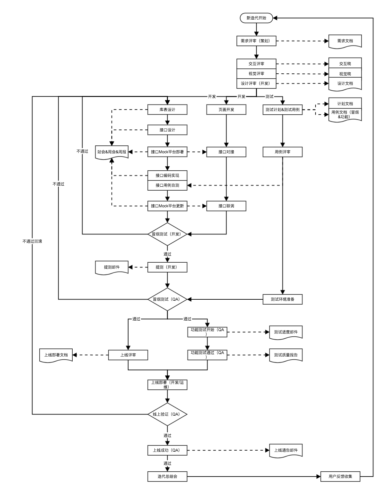

# JEasy 一款快速智能代码开发平台

简介
---
JEasy 是一款快速智能代码开发平台，面向使用Java开发的同仁们的。其关注各框架集成使用的基础代码构建过程。希望整合各种技术的规范和开发标准，能使您摆脱犹豫，摆脱选择的困难，规避没有经验带来的开发风险。不仅生成代码，同时还强调最佳实践，甚至包括名称规范。不仅仅只是提供技术，还会引导您应该如何使用好技术。

同时建议给您提供并强调良好的接口设计规范以及良好项目开发流程，确保在实现项目快速敏捷开发同时，降低研发资源成本、研发沟通成本的投入，使研发人员更多的精力关注在业务逻辑的代码实现。

前端技术
----
### jeasy-admin-front介绍
基于Vue.js，搭配使用iView UI组件库形成的一套后台集成解决方案，同时集成了两个优秀的iview开源框架优点，如下：

> 1. **[iview-admin](https://github.com/iview/iview-admin):** iview官方提供的一套后台集成解决方案，优点：遵守iView设计和开发约定，风格统一，设计考究，并且更多功能在不停开发中。
> 2. **[iview](https://github.com/zhaotoday/iview):** 基于 vue-cli + iView 的 Vue js 后台管理系统，在 vue-cli 基础上做了一些合理的修改和增强。功能包括：调试、构建、代码规范校验、单元测试、国际化等。

### 技术栈
> Vue、iview、axios、Webpack、ES6、vue-router、Vuex、Sass、PostCSS、Less等。

### 目录结构
```
|-- build                            // Webpack 项目构建
|-- config                           // 项目开发环境配置
|-- src                              // 源码目录
|   |-- app                          // 应用代码
|       |-- code                     // 代码平台模块
|       |-- dictionary               // 字典管理模块
|       |-- monitor                  // 日志监控模块
|   |-- components                   // 公共组件
|   |-- config                       // 项目开发环境配置
|   |-- i18n                         // 全局国际化
|   |-- images                       // 静态图片资源
|   |-- libs                         // 公共工具类
|   |-- models                       // 数据模型（主要在 store 中用到）
|   |-- router                       // 路由配置
|       |-- routes                   // 各业务模块路由配置
|   |-- store                        // Vuex 状态管理
|       |-- actions.js               // 根级别的 actions
|       |-- getters.js               // 根级别的 getters
|       |-- mutations.js             // 根级别的 mutations
|       |-- types.js                 // 根级别的 mutation types
|       |-- modules                  // 各业务模块的局部状态管理
|           |-- dictionary           // 字典管理模块状态管理
|           |-- iviewAdmin           // iviewAdmin状态管理
|           |-- login                // 登录/登出状态管理
|   |-- styles                       // 样式
|       |-- fonts                    // 字体
|       |-- global                   // 全局样式
|       |-- iview                    // 第三方 UI 库的样式（如：iView 等）
|       |-- utils                    // Sass 工具集合（如：vars、mixin、function 等）
|   |-- template                     // 模板文件
|   |-- utils                        // 工具集合
|       |-- helpers                  // 帮助函数集合
|       |-- mixins                   // 混合
|       |-- auth.js                  // 权限相关
|       |-- env.js                   // 环境配置类
|       |-- fastclick.js             // 全局处理移动端 onclick 事件的延迟 300 ms 问题（仅移动端需要引入）
|       |-- consts.js                // 常量配置
|       |-- i18n.js                  // 国际化类
|       |-- init.js                  // 初始化
|       |-- polyfill.js              // polyfill
|       |-- rest.js                  // RESTful 请求类
|   |-- views
|       |-- access                   // 权限管理
|       |-- advanced-router          // 高级路由
|       |-- error_page               // 错误页面
|       |-- form                     // 表单编辑
|       |-- home                     // 首页
|       │   |-- components           // 首页组件
|       |-- international            // 多语言
|       |-- main_components          // Main组件
|       │   |-- lockscreen           // 锁屏
|       │   |-- shrinkable-menu      // 可收缩菜单
|       │   |-- theme-switch         // 主题切换
|       |-- message                  // 消息中心
|       |-- my_components            // 业务组件
|       │   |-- area-linkage         // 中国行政区级联选择器
|       │   |-- count-to             // 数字渐变
|       │   |-- draggable-list       // 可拖拽列表
|       │   |-- file-upload          // 文件上传
|       │   |-- image-editor         // 图片预览编辑
|       │   |-- markdown-editor      // Markdown编辑器
|       │   |-- text-editor          // 富文本编辑器
|       |-- own-space                // 个人中心
|       |-- tables                   // 综合表格
|   |-- app.vue                      // 页面入口
|   |-- main.js                      // 程序入口，加载各种公共组件
|   |-- vendors.js                   // 公共库文件
|-- static                           // 静态文件，如：图片、JSON 数据等
|-- .babelrc                         // babel-loader 配置
|-- .editorconfig                    // 定义代码格式
|-- package.json                     // 项目基本信息
```

### 相关资料
- [前端技术全景展望](http://www.jianshu.com/p/6dca1f992507)
- [Vue.js 中文网](https://cn.vuejs.org/)
- [iView - 一套基于 Vue.js 的高质量 UI 组件库](https://www.iviewui.com/)
- [vue-router 中文网](http://router.vuejs.org/zh-cn/)
- [Vuex 中文网](https://vuex.vuejs.org/zh-cn/)
- [Vuex 通俗版教程](https://yeaseonzhang.github.io/2017/03/16/Vuex-%E9%80%9A%E4%BF%97%E7%89%88/)
- [Vuex 购物车示例](https://github.com/vuejs/vuex/tree/dev/examples/shopping-cart)
- [Vue2.0 实践阶段性分享](https://segmentfault.com/a/1190000007909108)
- [单文件组件](https://cn.vuejs.org/v2/guide/single-file-components.html)
- [vue-devtools](https://github.com/vuejs/vue-devtools)
- [一个极简的轻量级 Sass 工具库](https://github.com/zhaotoday/sass-utils)
- [AJAX 简单封装及使用规范](https://github.com/zhaotoday/rest)
- [基于 i18next 实现 Vue js 项目的国际化（整理中）](https://github.com/zhaotoday/i18n)
- [基于 CodeIgniter 的轻量级 PHP MVC 框架](https://github.com/zhaotoday/php-rich-app)
- [老版本的浏览器上访问时提示升级](https://github.com/zhaotoday/update-your-browser)

### 启动运行
```bash
# 下载代码
$ git clone https://gitee.com/taomk/easy-code.git

# 进入前端目录
$ cd jeasy-admin-front

# 安装依赖
$ npm install

# 开发调试
$ npm run dev

# 构建
$ npm run build
```


后端技术
----
### 主要功能
JEasy 目前只支持Spring MVC框架，可以从数据库读取表结构，直接生成这WEB工程的代码，包括DAO层，Manager层, Service层, Controller层代码，皆可以一键生成。

JEasy 框架生成的WEB工程代码, 自带以下特性:
> 1. 日志切面支持: 规范Controller层, Service层, Manager层, DAO层日志输出, 记录: 执行时间, 执行耗时, 执行参数, 执行结果等信息;
> 2. 参数校验支持: Controller层请求参数的校验, 自定义实现校验框架, 具体可参考DocController Demo演示;
> 3. 接口Doc支持: 接口Doc页面, 提供后端详细接口描述, 方便前端联调;
> 4. 集成WebService框架: CXF;
> 5. 集成权限控制框架: Shiro；
> 6. 集成微服务框架: Dubbox；
> 7. 集成消息框架: RabbitMQ;
> 8. 集成分布式任务：Scheduler;

### 技术栈
> Spring、Spring MVC、MyBatis-Plus、Shiro、Dubbo、Dubbox、RabbitMQ、CXF等。

### 目录结构
```
|-- db                   // 数据库初始化脚本
|-- deploy               // 自动化部署脚本
|-- jeasy-code-gen       // 代码生成模块
|-- jeasy-core           // 核心工具模块
|-- jeasy-cxf            // CXF集成模块
|-- jeasy-dao            // DAO层模块
|-- jeasy-front          // 前端代码模块
|-- jeasy-hessian        // Hessian集成模块
|-- jeasy-msa            // 服务集成模块
|-- jeasy-rabbitmq       // 消息集成模块
|-- jeasy-scheduler      // 分布式任务集成模块
|-- jeasy-service        // Service层模块
|-- jeasy-shiro          // 权限控制模块
|-- jeasy-web            // WEB应用模块
```

Nginx相关配置（可选）
-------------
```
#error_log  logs/error.log  notice;
error_log  logs/error.log  info;

pid        logs/nginx.pid;


events {
    worker_connections  256;
}


http {
    include       mime.types;
    default_type  application/octet-stream;

    log_format  main  '$remote_addr - $remote_user [$time_local] "$request" '
                      '$status $body_bytes_sent "$http_referer" '
                      '"$http_user_agent" "$http_x_forwarded_for"';

    access_log  logs/access.log  main;
    log_format  main  '$remote_addr - $remote_user [$time_local] "$request" '
                      '$status $body_bytes_sent "$http_referer" '
                      '"$http_user_agent" "$http_x_forwarded_for"';

    access_log  logs/access.log  main;

    port_in_redirect off;
    sendfile        on;
    #tcp_nopush     on;

    #keepalive_timeout  0;
    keepalive_timeout  65;

    #gzip  on;

    server {
        listen       80;
        server_name  localhost;
        # 后端API
        location / {
            proxy_pass http://localhost:8080;
        }

        #location ~ .*\.(js|css)?$ {
        #    root /Users/TaoBangren/eagle/dragon/trunk/dragon-front/dragon-admin-vue/dist/;
        #}

        #location ~ .*\.(gif|jpg|jpeg|png|bmp|swf|ico|woff2|woff|ico|eot|ttf|otf)?$ {
        #    root /Users/TaoBangren/eagle/dragon/trunk/dragon-front/dragon-admin-vue/dist/;
        #}
        # 验证码API
        location = /captcha.jpg {
            proxy_pass http://localhost:8080;
        }
        # 静态资源
        location ~ .*\.(js|css|js.map|css.map|json)?$ {
            proxy_pass http://localhost:9000;
        }
        # 静态资源
        location ~ .*\.(gif|jpg|jpeg|png|bmp|swf|ico|woff2|woff|ico|eot|ttf|otf)?$ {
            proxy_pass http://localhost:9000;
        }
        # DEV环境下，支持webpack热更新至浏览器
        location = /__webpack_hmr {
            proxy_pass http://localhost:9000;
            proxy_buffering off;
        }
    }

    #include servers/*;
}
```

开发流程
---


接口设计
---
[前后分离接口规范](http://www.jianshu.com/p/c81008b68350)

参与开发
---
首先谢谢大家支持，如果您希望参与开发，欢迎fork本项目，并Pull Request您的commit。

技术交流
-----------------------------------
* 	作者：陶邦仁
* 	邮箱：mingkai.tao@gmail.com
*	微信：扫码加微信


